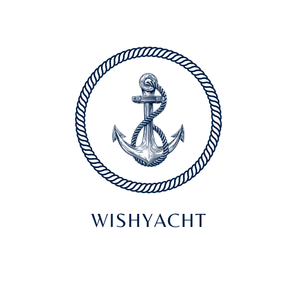
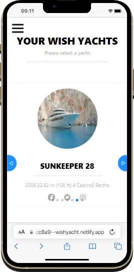
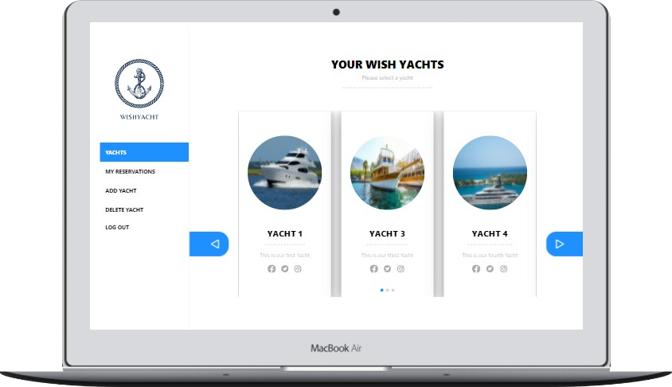

# WISHYACHT



<hr>






<hr>
## Description

> This is  a Web application where users should sign in to rent a Yacht from a list then reserve it for a determined period, users can then see their reservations or cancel them.

In this App users are allowed:
- To Signup and Login.
- To Reserve a Yacht from a specific city
- To See all his reservations.
- To Cancel  reservations.

Admins are allowed:
- To Login.
- To Add a new Yacht, or delete a Yacht.
<hr>


## Kanban bord
-  [Link to the initial state of the Kanban board](https://user-images.githubusercontent.com/92755394/177657371-659c399b-1846-44a2-811a-ba6d0e03858c.png)
- [Link to the final state of the Kanban board ](https://github.com/algerina/rent-yacht/projects/1)
- [Team members](https://github.com/algerina/rent-yacht#collaborators).


<hr>


## Api Documentation

>You can review the documentation for the API [here](https://wishyacht-api.herokuapp.com/api-docs/index.html
).
<hr>

 
## Back-end Repository 

[RailsApp](https://github.com/algerina/rent-yacht)


## Built With

Front-end
- [react](https://reactjs.org/) 
- [redux-toolkit](https://redux-toolkit.js.org/) 
- [react-router](https://reactrouter.com/)

Back-end
- 
- 
- 

## Additional used

- Devise
- JWT
- Bootstrap
- Rspec
- Jest
- Rswag

## Live demo

[LiveDemo](https://62d85bdd46314705734cc8a9--wishyacht.netlify.app/)

## Getting Started

To get a local copy up and running follow these simple example steps.

```sh
git clone git@github.com:Algerina/rent-yacht-frontend.git 
```

Then 
```sh
cd rent-yacht-frontend 
```

To install packages
```sh 
npm install
``` 

To Run the app
```sh 
npm start
```

To Run the test
```sh 
npm run test
```


 ## Collaborators

👤 **Edgar Esteban Muñoz Alba**

Platform | Badge |
 --- | --- |
 **GitHub**  | [@estebanmual](https://github.com/estebanmual)
 **Twitter** |[@estebanmual](https://twitter.com/estebanmual)
 **LinkedIn** | [LinkedIn](https://linkedin.com/in/estebanmual)
<hr>

 👤 **German Cobian**

Platform | Badge |
 --- | --- |
 **GitHub**  | [@German Cobian](https://github.com/German-Cobian)
 **Twitter** |[@GermanCobian2](https://twitter.com/GermanCobian2)
 **LinkedIn** | [@German Cobian](https://www.linkedin.com/in/german-cobian/)
<hr>

 👤 **Amel Khiri**

 Platform | Badge |
 --- | --- |
 **GitHub**  | [@Algerina](https://github.com/Algerina)
 **LinkedIn** | [@Amel Khiri](https://www.linkedin.com/in/amel-khiri/)
<hr>

 👤 **Francisco Ponce**

Platform | Badge |
 --- | --- |
 **GitHub**  |[@franciscoPonceDev](https://github.com/franciscoPonceDev)
 **LinkedIn** |  [Francisco Ponce](https://www.linkedin.com/in/dev-ponce/)
<hr>

 👤 **Omar Ragheb**

Platform | Badge |
 --- | --- |
 **GitHub**  |  [@omar25ahmed](https://github.com/omar25ahmed)
 **Twitter** |[@omar25Ahmed](https://twitter.com/Omar25Ahmed)
 **LinkedIn** | [@Omar-ragheb](https://www.linkedin.com/in/omar-ragheb/)
<hr>
 
## Show your support

Give a ⭐️ if you like this project!
<hr>

## Acknowledgments

Original design [Vespa](https://www.behance.net/gallery/26425031/Vespa-Responsive-Redesign/modules/173005583) by [Murat Korkmaz](https://www.behance.net/muratk) on [Behance](https://www.behance.net/)

<hr>

## 📝 License

This project is [MIT](./MIT.md) licensed.
